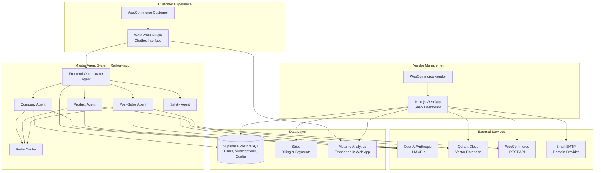
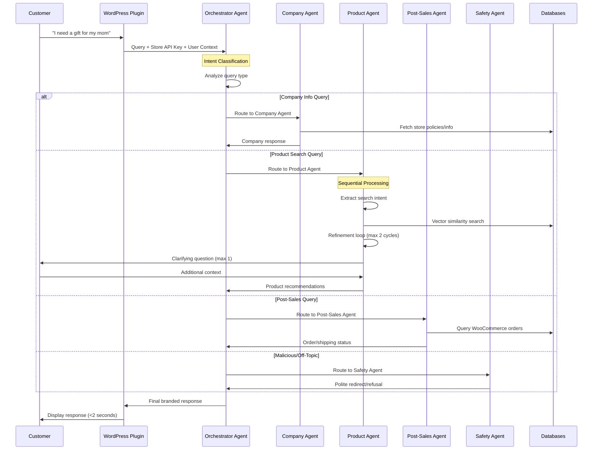

# WooVector.io System Architecture Design

## Executive Summary

**Project**: WooVector.io - Ultra-fast AI chatbots for WooCommerce vendors  
**Goal**: Help vendors increase sales by 20-30% through intelligent product discovery  
**Architecture**: Multi-agent Mastra system with sub-2-second response times  
**Deployment**: Railway.app containers + Supabase + Qdrant Cloud  

---

## 🏗️ System Architecture Overview



---

## 🤖 Mastra Agent Architecture

### Agent Orchestration Flow



### Agent Responsibilities

#### 1. Frontend Orchestrator Agent
- **Purpose**: Route queries to appropriate specialized agents
- **Logic**: Intent classification using LLM
- **Data Access**: None (routing only)
- **Response Time**: <200ms

#### 2. Company Agent
- **Purpose**: Handle store information, policies, business details
- **Queries**: Store hours, return policy, shipping info, contact details
- **Data Access**: Supabase (store configuration, policies)
- **Cache Strategy**: 1-hour TTL for store info

#### 3. Product Agent (Sequential + Refinement Loop)
- **Purpose**: Intelligent product discovery and recommendations
- **Processing Flow**:
  1. **Intent Extraction**: Understand customer needs (occasion, demographics, budget)
  2. **Vector Search**: Hybrid semantic + metadata filtering in Qdrant
  3. **Refinement Loop**: Up to 2 iterations to improve results
  4. **Clarification**: Max 1 question back to customer if needed
- **Data Access**: Qdrant Cloud (product vectors), Supabase (metadata)
- **Cache Strategy**: 5-minute TTL for search results

#### 4. Post-Sales Agent
- **Purpose**: Handle order status, shipping, returns, payment issues
- **Authentication**: JWT tokens from WordPress (signed user ID)
- **Data Access**: WooCommerce REST API (orders, shipping)
- **Cache Strategy**: 1-minute TTL for order data

#### 5. Safety Agent
- **Purpose**: Detect and handle malicious/off-topic messages
- **Detection**: Inappropriate language, spam, competitor questions
- **Response**: Polite redirect to relevant topics or refusal
- **Data Access**: None (LLM classification only)

---

## 🚀 Deployment Architecture

### Development Environment
```yaml
# docker-compose.yml
version: '3.8'
services:
  web-app:
    build: ./woovector
    ports: ["3000:3000"]
    environment:
      - DATABASE_URL=postgresql://localhost:5432/woovector_dev
      - SUPABASE_URL=http://localhost:54321
    
  redis:
    image: redis:alpine
    ports: ["6379:6379"]
    
  qdrant:
    image: qdrant/qdrant
    ports: ["6333:6333"]
```

### Production Environment (Railway.app)

#### Web App Service
- **Platform**: Railway.app
- **Container**: Next.js application
- **Database**: Supabase PostgreSQL (managed)
- **Storage**: Supabase Storage (for assets)
- **Domain**: Custom domain with SSL

#### Mastra Agent Service  
- **Platform**: Railway.app
- **Container**: Python FastAPI application
- **Scaling**: Auto-scale based on CPU/memory
- **Environment Variables**:
  ```env
  OPENAI_API_KEY=sk-...
  QDRANT_URL=https://xxx.qdrant.tech
  SUPABASE_URL=https://xxx.supabase.co
  REDIS_URL=redis://xxx.railway.app
  ```

#### External Services
- **Vector Database**: Qdrant Cloud (~$20/month)
- **Cache**: Railway Redis (~$3/month)  
- **LLM APIs**: OpenAI GPT-4 + Anthropic Claude
- **Email**: Domain provider SMTP (Aruba.it)
- **Analytics**: Matomo (embedded in Next.js app)

---

## 🔄 Data Flow Architecture

### 1. Customer Interaction Flow
```
Customer Query → WordPress Plugin → Mastra Agents → Vector Search → LLM Processing → Branded Response
```

**Performance Targets**:
- Total response time: <2 seconds
- Cache hit rate: >80%
- Success rate: >95%

### 2. Vendor Management Flow
```
Vendor → SaaS Dashboard → Supabase → WooCommerce API → Qdrant Sync → Product Import
```

**Key Operations**:
- Product import: Batch processing (1000 products/minute)
- Metadata enrichment: Real-time updates
- Usage tracking: Event-driven logging

### 3. Subscription & Billing Flow
```
Trial Signup → Stripe Checkout → Webhook → Supabase → Usage Tracking → Limit Enforcement
```

**Business Logic**:
- Free trial: 1 month with chosen tier limits
- Usage enforcement: Real-time checks before agent calls
- Overage handling: Block or pay-per-use (vendor choice)

---

## 🔐 Security Architecture

### Authentication & Authorization
- **Vendors**: Supabase Auth (email/password, social login)
- **WordPress Plugin**: Store-specific API keys
- **Post-Sales**: JWT tokens (signed user ID + timestamp)
- **Rate Limiting**: 60 requests/minute per store, 10/minute per IP

### Data Protection
- **API Keys**: Encrypted storage in Supabase
- **WooCommerce Credentials**: AES-256 encryption
- **User Data**: GDPR compliant (EU hosting)
- **Audit Logging**: All admin actions tracked

### API Security
```python
# JWT Authentication for Post-Sales
def verify_user_token(token: str, store_secret: str) -> dict:
    try:
        payload = jwt.decode(token, store_secret, algorithms=['HS256'])
        return {"user_id": payload["user_id"], "valid": True}
    except jwt.InvalidTokenError:
        return {"valid": False}
```

---

## 📊 Monitoring & Analytics

### System Monitoring
- **Response Times**: Per agent type and overall
- **Error Rates**: 5xx errors, LLM API failures
- **Resource Usage**: CPU, memory, API costs
- **Cache Performance**: Hit rates, eviction patterns

### Business Analytics
- **Conversation Metrics**: Volume, success rate, user satisfaction
- **Product Performance**: Most recommended, conversion rates
- **Vendor Analytics**: Usage patterns, subscription health
- **Revenue Tracking**: MRR, churn, trial conversions

### Alerting Thresholds
```yaml
alerts:
  response_time: >3 seconds
  error_rate: >5%
  api_costs: >€10/day per store
  cache_hit_rate: <70%
  agent_availability: <99%
```

---

## 💰 Cost Optimization Strategy

### Infrastructure Costs (Monthly)
- **Railway.app Web App**: ~$5-20 (based on usage)
- **Railway.app Mastra Agents**: ~$10-30 (auto-scaling)
- **Supabase**: ~$25 (Pro plan for production)
- **Qdrant Cloud**: ~$20 (Starter cluster)
- **Redis Cache**: ~$3 (Railway addon)
- **Total Infrastructure**: ~$63-98/month

### Variable Costs
- **OpenAI API**: ~$0.002 per conversation (GPT-4 Turbo)
- **Email**: Included with domain provider
- **Monitoring**: Free tier (Railway built-in)

### Revenue vs Costs
- **Break-even**: ~3-4 paying customers (€29/month each)
- **Target margin**: 80%+ gross margin at scale
- **Cost per conversation**: <€0.01 (including infrastructure)

---

## 🔧 Implementation Roadmap

### Phase 1: Core Infrastructure (Weeks 1-2)
- [ ] Set up Railway.app deployment pipeline
- [ ] Configure Supabase database with new tables
- [ ] Implement basic Mastra agent structure
- [ ] Create WordPress plugin authentication

### Phase 2: Agent Development (Weeks 3-4)
- [ ] Build Frontend Orchestrator with intent classification
- [ ] Implement Company Agent (store info queries)
- [ ] Develop Product Agent with vector search
- [ ] Add Safety Agent for content filtering

### Phase 3: Advanced Features (Weeks 5-6)
- [ ] Implement Post-Sales Agent with WooCommerce integration
- [ ] Add refinement loops and clarification questions
- [ ] Set up caching and performance optimization
- [ ] Integrate monitoring and alerting

### Phase 4: Production Ready (Weeks 7-8)
- [ ] Load testing and performance tuning
- [ ] Security audit and penetration testing
- [ ] Documentation and vendor onboarding
- [ ] Launch beta with select vendors

---

## 🎯 Success Metrics

### Technical KPIs
- **Response Time**: <2 seconds (95th percentile)
- **Uptime**: >99.9% availability
- **Accuracy**: >90% customer satisfaction
- **Cost Efficiency**: <€0.01 per conversation

### Business KPIs
- **Vendor Conversion**: 20% trial-to-paid conversion
- **Revenue Growth**: €10k MRR within 6 months
- **Customer Success**: 20-30% sales increase for vendors
- **Retention**: <5% monthly churn rate

---

## 📋 Next Steps

1. **Review and approve** this system architecture
2. **Set up development environment** with Docker Compose
3. **Create Railway.app accounts** and configure deployment
4. **Begin Phase 1 implementation** with core infrastructure
5. **Establish monitoring** and performance baselines

**Ready to build WooVector.io! 🚀**

---

*Generated on: October 3, 2025*  
*Project: WooVector.io System Architecture*  
*Template: Mastra Agent SaaS*
