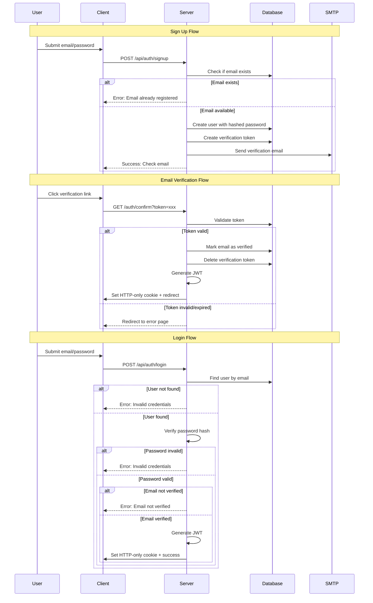

# Supabase to Dockerized PostgreSQL Migration Plan

## Overview

This plan outlines the migration from Supabase authentication to a self-hosted PostgreSQL database with a custom JWT-based authentication system.

## Current State Analysis

### Supabase Usage

The application currently uses Supabase for:
- **Authentication**: Email/password login, signup, password reset, email verification
- **Session Management**: Cookie-based sessions via `@supabase/ssr`
- **Middleware**: Route protection via `updateSession()` in [`middleware.ts`](woovector/middleware.ts:1)

### Database Tables (Already in PostgreSQL via Drizzle)

The following tables are already managed by Drizzle ORM and will remain unchanged:

| Table | Description |
|-------|-------------|
| `users` | User profile data (id, email, full_name, role, stripe_customer_id) |
| `contact_submissions` | Contact form submissions |
| `session_names` | Chat session names for AI conversations |
| `user_usage_events` | Usage tracking events |
| `subscription_plans` | Available subscription plans |
| `vendor_subscriptions` | User subscription records |
| `vendor_stores` | Vendor store configurations |
| `products` | Product catalog |

### Files to Modify

| File | Changes |
|------|---------|
| [`woovector/lib/supabase/server.ts`](woovector/lib/supabase/server.ts:1) | Replace with JWT auth utilities |
| [`woovector/lib/supabase/middleware.ts`](woovector/lib/supabase/middleware.ts:1) | Replace with JWT verification |
| [`woovector/lib/auth.ts`](woovector/lib/auth.ts:1) | Update to use new auth system |
| [`woovector/app/actions/auth.ts`](woovector/app/actions/auth.ts:1) | Rewrite for JWT-based auth |
| [`woovector/middleware.ts`](woovector/middleware.ts:1) | Update imports |
| [`woovector/app/(auth)/auth/confirm/route.ts`](woovector/app/(auth)/auth/confirm/route.ts:1) | Rewrite for token verification |
| [`woovector/lib/env.ts`](woovector/lib/env.ts:1) | Update environment variables |
| [`poc/docker-compose.yml`](poc/docker-compose.yml:1) | Add PostgreSQL service |

---

## New Architecture

### Authentication Flow



### Database Schema Additions

New tables needed for authentication:

```sql
-- Extend users table with auth fields
ALTER TABLE users ADD COLUMN password_hash text;
ALTER TABLE users ADD COLUMN email_verified boolean DEFAULT false;

-- Verification tokens for email verification and password reset
CREATE TABLE verification_tokens (
    id uuid PRIMARY KEY DEFAULT gen_random_uuid(),
    user_id uuid NOT NULL REFERENCES users(id) ON DELETE CASCADE,
    token text NOT NULL UNIQUE,
    type text NOT NULL, -- 'email_verification' or 'password_reset'
    expires_at timestamp with time zone NOT NULL,
    created_at timestamp with time zone DEFAULT now() NOT NULL
);

-- Indexes for performance
CREATE INDEX idx_verification_tokens_token ON verification_tokens(token);
CREATE INDEX idx_verification_tokens_user_id ON verification_tokens(user_id);
```

### JWT Configuration

| Setting | Value | Notes |
|---------|-------|-------|
| Algorithm | HS256 | Secure and widely supported |
| Expiration | 7 days | Persistent sessions as requested |
| Storage | HTTP-only cookie | Secure against XSS |
| Cookie Name | `auth_token` | |
| Cookie Options | `httpOnly, secure, sameSite=strict` | |

### Environment Variables

Variables to add:
```env
# JWT Configuration
JWT_SECRET=your-256-bit-secret-key

# SMTP Configuration
SMTP_HOST=smtp.example.com
SMTP_PORT=587
SMTP_USER=your-smtp-user
SMTP_PASSWORD=your-smtp-password
SMTP_FROM=noreply@yourdomain.com
```

Variables to remove:
```env
SUPABASE_URL=
SUPABASE_ANON_KEY=
SUPABASE_SERVICE_ROLE_KEY=
```

---

## Implementation Steps

### Phase 1: Infrastructure Setup

1. **Update docker-compose.yml**
   - Add PostgreSQL 16 service with proper volumes
   - Configure health checks
   - Set up network for service communication

2. **Create Auth Database Schema**
   - Add Drizzle schema for `verification_tokens` table
   - Add auth fields to existing `users` table
   - Generate and run migration

### Phase 2: Core Auth Implementation

3. **Create JWT Utilities** (`lib/auth/jwt.ts`)
   - `signJWT(payload, expiresInSeconds)` - Create JWT token
   - `verifyJWT(token)` - Validate and decode JWT
   - `hashPassword(password)` - Hash password with bcrypt
   - `verifyPassword(password, hash)` - Verify password against hash

4. **Create Cookie Utilities** (`lib/auth/cookies.ts`)
   - `setAuthCookie(token)` - Set HTTP-only auth cookie
   - `getAuthCookie(request)` - Get auth token from cookie
   - `clearAuthCookie()` - Clear auth cookie on logout

5. **Create Email Service** (`lib/auth/email.ts`)
   - `sendVerificationEmail(email, token)` - Send email verification
   - `sendPasswordResetEmail(email, token)` - Send password reset link
   - Use nodemailer with SMTP configuration

### Phase 3: Server Actions

6. **Rewrite Auth Actions** (`app/actions/auth.ts`)
   - `loginAction(email, password)` - Authenticate user
   - `signUpAction(email, password, fullName)` - Create new user
   - `logoutAction()` - Clear session
   - `resetPasswordAction(email)` - Send password reset email
   - `updatePasswordAction(password)` - Update password after reset

7. **Create Token Verification Route** (`app/(auth)/auth/confirm/route.ts`)
   - Handle email verification tokens
   - Handle password reset tokens
   - Set auth cookie on successful verification

### Phase 4: Middleware & Integration

8. **Update Middleware** (`lib/auth/middleware.ts`)
   - Verify JWT from cookie
   - Attach user to request
   - Handle protected routes

9. **Update Auth Helper Functions** (`lib/auth.ts`)
   - `getCurrentUser()` - Get user from JWT
   - `getCurrentUserId()` - Get just the user ID
   - `requireUserId()` - Require authentication

### Phase 5: Cleanup

10. **Remove Supabase Dependencies**
    - Remove `@supabase/supabase-js` and `@supabase/ssr` from package.json
    - Delete `lib/supabase/` directory
    - Update imports across all files

11. **Update Environment Configuration**
    - Remove Supabase env vars from `lib/env.ts`
    - Add JWT and SMTP env vars

---

## File Structure After Migration

```
woovector/
├── lib/
│   ├── auth/
│   │   ├── index.ts          # Re-exports all auth functions
│   │   ├── jwt.ts            # JWT sign/verify utilities
│   │   ├── cookies.ts        # Cookie management
│   │   ├── email.ts          # SMTP email service
│   │   ├── middleware.ts     # Auth middleware
│   │   └── password.ts       # Password hashing utilities
│   ├── drizzle/
│   │   ├── db.ts
│   │   └── schema/
│   │       ├── users.ts      # Updated with auth fields
│   │       ├── verification-tokens.ts  # New
│   │       └── ...
│   └── env.ts                # Updated env vars
├── app/
│   ├── actions/
│   │   └── auth.ts           # Rewritten for JWT
│   └── (auth)/
│       └── auth/
│           └── confirm/
│               └── route.ts  # Rewritten for tokens
└── middleware.ts             # Updated imports
```

---

## Security Considerations

1. **Password Hashing**: Use bcrypt with cost factor 12
2. **JWT Secret**: Must be at least 256 bits (32 characters)
3. **Token Expiration**: Verification tokens expire after 24 hours
4. **Rate Limiting**: Consider adding rate limiting to auth endpoints
5. **CSRF Protection**: SameSite cookies provide baseline protection

---

## Testing Checklist

- [ ] User can sign up with email verification
- [ ] User receives verification email
- [ ] User can verify email via link
- [ ] User can log in with correct credentials
- [ ] User cannot log in with wrong password
- [ ] User cannot log in with unverified email
- [ ] User stays logged in across browser restarts
- [ ] User can log out
- [ ] User can request password reset
- [ ] User can reset password via email link
- [ ] Protected routes redirect to login when not authenticated
- [ ] JWT expires after 7 days
- [ ] Middleware correctly identifies user

---

## Dependencies to Add

```json
{
  "dependencies": {
    "bcrypt": "^5.1.1",
    "jsonwebtoken": "^9.0.2",
    "nodemailer": "^6.9.8"
  },
  "devDependencies": {
    "@types/bcrypt": "^5.0.2",
    "@types/jsonwebtoken": "^9.0.5",
    "@types/nodemailer": "^6.4.14"
  }
}
```

## Dependencies to Remove

```json
{
  "dependencies": {
    "@supabase/supabase-js": "...",
    "@supabase/ssr": "..."
  }
}
```
